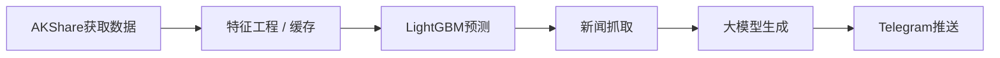
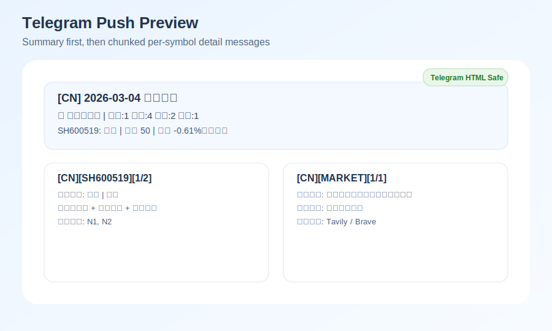

# llm_stock_report

[](https://github.com/miaohancheng/llm_stock_report/blob/main/LICENSE)
[](https://github.com/miaohancheng/llm_stock_report/actions/workflows/daily_cn.yml)
[](https://github.com/miaohancheng/llm_stock_report/actions/workflows/daily_hk.yml)
[](https://github.com/miaohancheng/llm_stock_report/actions/workflows/daily_us.yml)
[](https://github.com/miaohancheng/llm_stock_report/actions/workflows/weekly_retrain.yml)
[](https://www.python.org/downloads/)

**AI + 传统量化双驱动：** 不是单纯的 LLM 闲聊，而是基于 LightGBM 的客观预测辅助。  
**AI + Quant Dual Engine:** This is not pure LLM chatting; it is grounded by objective LightGBM-based prediction signals.  
**开箱即用的自动化：** 内置完整的 GitHub Actions 工作流，无需服务器即可白嫖算力。  
**Automation Out of the Box:** Built-in end-to-end GitHub Actions workflows, so you can run it without maintaining your own server.  
**支持本地/私有化部署：** 全面兼容本地大语言模型，零 API 成本运行。  
**Local / Private Deployment Ready:** Fully compatible with local LLMs for zero API-cost operation.  

LLM daily stock summary + next-day prediction for CN/US/HK markets, with scheduled GitHub Actions and Telegram delivery.

简体中文 | [English](#english)

- 中文完整使用文档: [docs/full-guide.md](docs/full-guide.md)
- English full guide: [docs/full-guide_EN.md](docs/full-guide_EN.md)
- GitHub Actions 配置手册（中文）: [docs/github-actions-setup.md](docs/github-actions-setup.md)
- GitHub Actions setup guide (EN): [docs/github-actions-setup_EN.md](docs/github-actions-setup_EN.md)

## Pipeline


## 中文

### 推送预览


### 项目功能
- A股使用 `AKShare`，美股/港股使用 `yfinance` 拉取历史行情
- 本地历史缓存 + 增量补齐（避免每次全量拉取）
- 生成技术指标与 `next_day_return` 标签
- 每周训练（Qlib 风格 LightGBM）+ 每日推理
- 抓取失败自动重试（长间隔指数退避，适配反爬限流）
- Tavily 主搜索、Brave 兜底新闻搜索
- 支持 OpenAI / Gemini / Ollama 生成中文摘要与详细推理
- 提示词强化：证据引用、置信度、可靠性说明、风险约束
- Telegram 推送顺序：摘要 1 条 -> 按股票详细分段 -> 大盘复盘
- 输出目录：`outputs/{market}/{date}/`

### 快速开始
1. 安装依赖
```bash
python -m pip install -r requirements.txt
```
2. 配置股票池
- 编辑 `config/universe.yaml`
3. 配置环境变量
- 复制 `.env.example` 到 `.env` 并填写密钥
4. 手动训练
```bash
python -m app.jobs.run_retrain --market cn --date 2026-03-04
python -m app.jobs.run_retrain --market us --date 2026-03-04
python -m app.jobs.run_retrain --market hk --date 2026-03-04
```
5. 生成日报
```bash
python -m app.jobs.run_report --market cn --date 2026-03-04
python -m app.jobs.run_report --market us --date 2026-03-04
python -m app.jobs.run_report --market hk --date 2026-03-04
```

### 必需环境变量
- `TAVILY_API_KEY`
- `BRAVE_API_KEY`
- `TELEGRAM_BOT_TOKEN`
- `TELEGRAM_CHAT_ID`

LLM 至少配置一组：
- `LLM_PROVIDER=openai` + `OPENAI_API_KEY`
- `LLM_PROVIDER=gemini` + `GEMINI_API_KEY`
- `LLM_PROVIDER=ollama` + `OLLAMA_BASE_URL` + `OLLAMA_MODEL`（本地默认可直接用）

### 关键可选参数（推荐配置）
- `LLM_PROVIDER`（`openai` / `gemini` / `ollama`）
- `REPORT_LANGUAGE`（`zh` / `en`，控制 Telegram 推送与报告文本语言）
- `PAGES_DEFAULT_LANGUAGE`（`zh` / `en`，控制 GitHub Pages 默认入口语言）
- `STOCK_LIST_CN` / `STOCK_LIST_US` / `STOCK_LIST_HK`（环境变量覆盖股票池）
- `TRAINING_WINDOW_DAYS`（训练窗口天数，默认 730）
- `FEATURE_WARMUP_DAYS`（特征预热天数，默认 60）
- `FETCH_MAX_RETRIES`（抓取最大重试次数，默认 5）
- `FETCH_RETRY_BASE_DELAY_SECONDS`（重试基础间隔，默认 15 秒）
- `FETCH_RETRY_MAX_DELAY_SECONDS`（重试最大间隔，默认 300 秒）
- `LLM_MAX_RETRIES`（LLM 最大重试次数，默认 6）
- `LLM_RETRY_BASE_DELAY_SECONDS`（LLM 重试基础间隔，默认 5 秒）
- `LLM_RETRY_MAX_DELAY_SECONDS`（LLM 重试最大间隔，默认 120 秒）
- `MARKET_INDEX_FETCH_ENABLED`（是否抓取指数基准，默认 true）
- `GEMINI_MODEL`（默认 `gemini-2.0-flash`）
- `OLLAMA_MODEL`（默认 `qwen2.5:7b`）
- `OLLAMA_BASE_URL`（默认 `http://127.0.0.1:11434`）

### GitHub Actions
- `daily_cn.yml`：UTC `0 8 * * 1-5`（北京时间工作日 16:00）
- `daily_hk.yml`：UTC `30 9 * * 1-5`（北京时间工作日 17:30）
- `daily_us.yml`：UTC `30 23 * * 1-5`（北京时间次日 07:30）
- `deploy_pages.yml`：自动发布 GitHub Pages（详细文档 + 每日案例）
- 以上定时均为自动运行；CN/HK 在北京时间工作日触发，US 在北京时间周二到周六早晨触发（覆盖美股前一交易日）
- GitHub Hosted Runner 默认无法访问你本机 Ollama；Ollama 仅建议本地运行或 self-hosted runner 使用
- `weekly_retrain.yml`：每周重训 CN/US/HK

### GitHub Pages
- Pages 内容分两块：
  - 详细使用文档（中英文）
  - 每日案例更新（由日报工作流自动写入 `pages_data/`）
- 首次启用：
  - 仓库 `Settings` -> `Pages`
  - `Build and deployment` 的 `Source` 选 `GitHub Actions`
  - 手动触发一次 `Deploy GitHub Pages` workflow 或等待下次自动触发
- 发布后地址通常为：`https://<owner>.github.io/<repo>/`
- 语言页结构：
  - `.../<repo>/zh/`（中文页面，默认打开中文文档入口）
  - `.../<repo>/en/`（英文页面，默认打开英文文档入口）

### 输出文件
- `summary.md`
- `details.md`
- `predictions.csv`
- `run_meta.json`
- `details.md` 末尾附加当日大盘复盘（CN/US/HK）

### 文档
- 中文完整指南: [docs/full-guide.md](docs/full-guide.md)
- 英文完整指南: [docs/full-guide_EN.md](docs/full-guide_EN.md)
- GitHub Actions 配置手册: [docs/github-actions-setup.md](docs/github-actions-setup.md)

---

## English

### Preview


### Features
- Fetches CN history via `AKShare` and US/HK history via `yfinance`
- Uses local history cache with incremental top-up (instead of full re-download each run)
- Builds technical factors and `next_day_return` labels
- Weekly retraining (Qlib-style LightGBM) and daily inference
- Adds long-interval exponential retry for data fetch failures
- News search with Tavily primary and Brave fallback
- Chinese report generation with OpenAI / Gemini / Ollama
- Prompt hardening for reliability: evidence refs, confidence score, reliability notes
- Telegram send order: one summary message, per-symbol chunked details, then market overview
- Output path: `outputs/{market}/{date}/`

### Quick Start
1. Install dependencies
```bash
python -m pip install -r requirements.txt
```
2. Configure symbol universe
- Edit `config/universe.yaml`
3. Configure env vars
- Copy `.env.example` to `.env` and fill secrets
4. Retrain models
```bash
python -m app.jobs.run_retrain --market cn --date 2026-03-04
python -m app.jobs.run_retrain --market us --date 2026-03-04
python -m app.jobs.run_retrain --market hk --date 2026-03-04
```
5. Run daily reports
```bash
python -m app.jobs.run_report --market cn --date 2026-03-04
python -m app.jobs.run_report --market us --date 2026-03-04
python -m app.jobs.run_report --market hk --date 2026-03-04
```

### Required environment variables
- `TAVILY_API_KEY`
- `BRAVE_API_KEY`
- `TELEGRAM_BOT_TOKEN`
- `TELEGRAM_CHAT_ID`

Configure at least one LLM path:
- `LLM_PROVIDER=openai` + `OPENAI_API_KEY`
- `LLM_PROVIDER=gemini` + `GEMINI_API_KEY`
- `LLM_PROVIDER=ollama` + `OLLAMA_BASE_URL` + `OLLAMA_MODEL` (local defaults available)

### Important optional knobs
- `LLM_PROVIDER` (`openai` / `gemini` / `ollama`)
- `REPORT_LANGUAGE` (`zh` / `en`, controls Telegram/report language)
- `PAGES_DEFAULT_LANGUAGE` (`zh` / `en`, controls default landing language for GitHub Pages)
- `STOCK_LIST_CN` / `STOCK_LIST_US` / `STOCK_LIST_HK` (env override for universe)
- `TRAINING_WINDOW_DAYS` (default `730`)
- `FEATURE_WARMUP_DAYS` (default `60`)
- `FETCH_MAX_RETRIES` (default `5`)
- `FETCH_RETRY_BASE_DELAY_SECONDS` (default `15`)
- `FETCH_RETRY_MAX_DELAY_SECONDS` (default `300`)
- `LLM_MAX_RETRIES` (default `6`)
- `LLM_RETRY_BASE_DELAY_SECONDS` (default `5`)
- `LLM_RETRY_MAX_DELAY_SECONDS` (default `120`)
- `MARKET_INDEX_FETCH_ENABLED` (enable benchmark index fetch, default `true`)
- `GEMINI_MODEL` (default `gemini-2.0-flash`)
- `OLLAMA_MODEL` (default `qwen2.5:7b`)
- `OLLAMA_BASE_URL` (default `http://127.0.0.1:11434`)

### GitHub Actions
- `daily_cn.yml`: UTC `0 8 * * 1-5` (16:00 Asia/Shanghai on weekdays)
- `daily_hk.yml`: UTC `30 9 * * 1-5` (17:30 Asia/Shanghai on weekdays)
- `daily_us.yml`: UTC `30 23 * * 1-5` (07:30 Asia/Shanghai next day)
- `deploy_pages.yml`: auto-publish GitHub Pages (detailed docs + daily cases)
- All schedules run automatically every trading day window: CN/HK on Asia/Shanghai weekdays, US on Asia/Shanghai Tue-Sat morning.
- GitHub-hosted runners cannot access your local Ollama by default; use Ollama locally or on self-hosted runners.
- `weekly_retrain.yml`: weekly retraining for CN/US/HK models

### GitHub Pages
- Pages includes two sections:
  - detailed usage docs (ZH/EN)
  - daily case updates (auto-written by daily workflows into `pages_data/`)
- First-time enablement:
  - Go to `Settings` -> `Pages`
  - Set `Build and deployment` -> `Source` to `GitHub Actions`
  - Trigger `Deploy GitHub Pages` once manually, or wait for auto trigger
- Published URL is typically: `https://<owner>.github.io/<repo>/`
- Language routes:
  - `.../<repo>/zh/` (Chinese pages with Chinese docs as default)
  - `.../<repo>/en/` (English pages with English docs as default)

### Outputs
- `summary.md`
- `details.md`
- `predictions.csv`
- `run_meta.json`
- market overview is appended at the end of `details.md`

### Documentation
- Chinese full guide: [docs/full-guide.md](docs/full-guide.md)
- English full guide: [docs/full-guide_EN.md](docs/full-guide_EN.md)
- GitHub Actions setup guide: [docs/github-actions-setup_EN.md](docs/github-actions-setup_EN.md)
